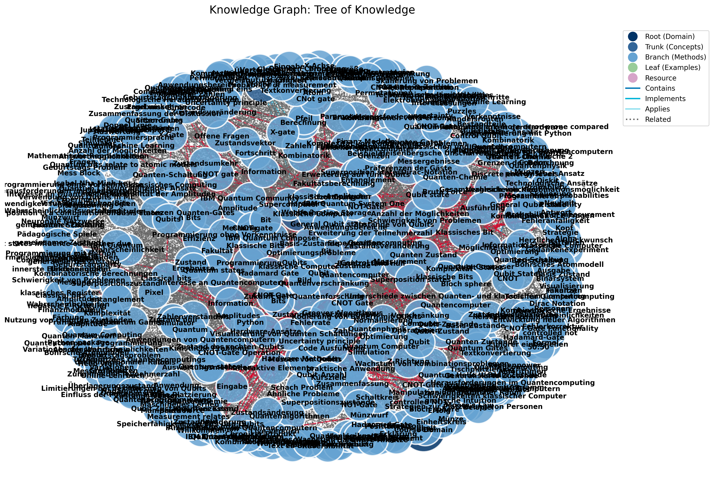

# 📚 Material Ingestion Pipeline

**Transform Educational Content into Interactive Knowledge Graphs**

[](https://www.python.org/downloads/)
[](LICENSE)
[](https://fastapi.tiangolo.com/)
[](https://streamlit.io/)

The Material Ingestion Pipeline is a comprehensive system that processes educational materials (PDFs, transcripts, slides) and automatically generates hierarchical knowledge graphs with rich metadata, interactive visualizations, and semantic embeddings.


---

## 📑 Table of Contents

- [Key Features](#-key-features)
- [Screenshots](#️-screenshots)
- [Overview](#-overview)
- [Installation](#-installation)
- [Quick Start](#-quick-start)
- [Configuration](#️-configuration)
- [Knowledge Graph Features](#enhanced-knowledge-graph-features)
- [API Documentation](#api-endpoints-reference)
- [Directory Structure](#directory-structure)
- [Integration](#integration-with-vision--mood-board-creation)
- [Support](#support)

---

## ✨ Key Features

- **📊 Automated Knowledge Graph Generation** - Extract concepts, relationships, and hierarchies from educational content
- **🎨 Interactive Visualizations** - Explore knowledge graphs with interactive HTML and static PNG outputs
- **🔍 Semantic Search** - Vector embeddings enable intelligent content retrieval
- **🌐 Web Interface** - User-friendly Streamlit UI for pipeline management
- **🚀 REST API** - FastAPI backend for programmatic access
- **📈 Real-time Monitoring** - Track pipeline progress with live status updates
- **🎯 Multi-Source Integration** - Process course materials, transcripts, slides, and visual content
- **🏗️ Production-Ready** - Modular architecture with comprehensive error handling

## 🖼️ Screenshots

### Web Dashboard
The intuitive web interface makes it easy to configure and run the pipeline:


### Pipeline Execution
Monitor your pipeline in real-time with progress tracking:


### API Documentation
Full REST API with interactive documentation:


### Knowledge Graph Output
Beautiful, hierarchical visualization of extracted knowledge:

<details>
<summary>View Knowledge Graph Example (Click to expand)</summary>



</details>

## 🎯 Overview

The Material Ingestion Pipeline processes course materials through a sophisticated 9-stage pipeline:

1. **Extract Course Context** - Analyze course information and structure
2. **Process Transcripts** - Extract knowledge from lecture transcripts
3. **Process Slides** - Analyze presentation materials
4. **Vision Analysis** - Extract information from visual content
5. **Fuse Contexts** - Combine information from all sources
6. **Run Supervision** - Validate and enhance extracted knowledge
7. **Generate Knowledge Graph** - Create hierarchical knowledge structures
8. **Create Visualizations** - Generate interactive and static outputs
9. **Generate Embeddings** - Create vector representations for semantic search

**Output:**
- Hierarchical knowledge graph with rich metadata
- Interactive HTML visualizations
- High-resolution static PNG visualizations
- Vector embeddings for semantic search
- Comprehensive pipeline reports

## 📦 Installation

### Prerequisites

- Python 3.9 or higher
- OpenAI API key ([Get one here](https://platform.openai.com/api-keys))

### Quick Install

1. **Clone the repository:**
   ```bash
   git clone https://github.com/siddhant61/material-ingestion-pipeline.git
   cd material-ingestion-pipeline
   ```

2. **Install dependencies:**
   ```bash
   pip install -r requirements.txt
   ```

3. **Configure environment:**
   ```bash
   cp .env.example .env
   # Edit .env and add your OPENAI_API_KEY
   ```

4. **Run the application:**
   ```bash
   # Start the web interface
   ./start_api.sh    # In one terminal
   ./start_ui.sh     # In another terminal
   
   # Or use the CLI
   python cli.py run-pipeline --input-dir ./input --output-dir ./output
   ```

### One-Command Installation (Optional)

For convenience, you can use the installation scripts:

```bash
./install_and_run.sh    # Unix/Linux/Mac
install_and_run.bat     # Windows
```

## ⚙️ Configuration

The pipeline uses a centralized configuration system that externalizes all settings through environment variables.

### Setup

1. **Copy the example environment file:**
   ```bash
   cp .env.example .env
   ```

2. **Edit `.env` and add your configuration:**
   ```bash
   # Required: OpenAI API key
   OPENAI_API_KEY=your_openai_api_key_here
   
   # Optional: AI model settings (defaults shown)
   AI_MODEL_NAME=gpt-3.5-turbo
   AI_MODEL_TEMPERATURE=0.2
   AI_FALLBACK_MODEL=gpt-3.5-turbo
   ```

3. **Customize paths (optional):**
   ```bash
   # The pipeline uses sensible defaults, but you can override:
   INPUT_DIR=/path/to/custom/input
   OUTPUT_DIR=/path/to/custom/output
   ```

### Configuration Options

All configuration is managed through `core/config.py` using Pydantic Settings:

- **API Keys**: `OPENAI_API_KEY` - Required for AI model access
- **AI Models**: 
  - `AI_MODEL_NAME` - Primary model (default: `gpt-3.5-turbo`)
  - `AI_MODEL_TEMPERATURE` - Response randomness 0.0-1.0 (default: `0.2`)
  - `AI_FALLBACK_MODEL` - Backup model if primary fails (default: `gpt-3.5-turbo`)
- **Directories**: All paths are auto-configured relative to the project root, but can be overridden via environment variables

### Benefits

- ✅ No hardcoded paths or secrets in code
- ✅ Easy environment-specific configuration
- ✅ Type-safe settings with Pydantic validation
- ✅ Clear documentation via `.env.example`

## Enhanced Knowledge Graph Features

### Hierarchical Structure

The knowledge graph is organized in a tree-like structure with multiple levels:

- **Roots**: Domain, field, subject areas (foundation of knowledge)
- **Trunk**: Major theories, principles, frameworks
- **Branches**: Supporting concepts, methods, techniques
- **Leaves/Fruits**: Practical applications, examples, implementations
- **Resources**: Supporting definitions, visualizations, references

### Information Source Tracking

Entities in the knowledge graph are color-coded based on their information source:

- **Course Materials**: Content extracted directly from course documents
- **Transcripts**: Information from lecture transcripts
- **Slides**: Content from presentation slides
- **RAG**: Information added through Retrieval-Augmented Generation
- **Visual RAG**: Content derived from visual recognition
- **External**: Information from additional external sources

### Temporal Information

Knowledge graph entities include temporal data indicating:

- **Origin Year**: When concepts were first introduced
- **Historical Period**: Ancient, Medieval, Renaissance, Classical, Modern, Contemporary, Recent
- **Chronological Relationships**: How concepts evolved over time

### Additional Metadata

Entities are enriched with:

- **Definitions**: Formal definitions of concepts
- **Visual Representations**: Links to related visual content
- **Educational Resources**: Supporting materials for teaching
- **References**: Citations and external resources

## Knowledge Graph Visualization

### Interactive Visualization

The interactive HTML visualization provides:

- **Hierarchical Layout**: Tree-like structure showing relationships between concepts
- **Color Coding**:
  - Node borders by information source
  - Node fill by hierarchy level
- **Visual Differentiation**:
  - Different shapes for different hierarchy levels
  - Size variations based on concept importance
- **Rich Tooltips**: Detailed information on hover including definitions and temporal data
- **Legend**: Interactive legend explaining colors and shapes
- **Navigation**: Pan, zoom, and select features for exploring the graph

### Static Visualization

The static PNG visualization offers:

- **Hierarchical Layout**: Organized by knowledge level
- **Color Scheme**: Consistent with the interactive visualization
- **Legend**: Comprehensive legend for interpretation
- **High Resolution**: Suitable for presentations and documentation

## 🚀 Quick Start

### Option 1: Web Interface (Recommended)

The easiest way to use the pipeline is through the web interface:

**Step 1: Start the API Server**
```bash
./start_api.sh        # Unix/Linux/Mac
start_api.bat         # Windows
```

**Step 2: Start the Web UI**
```bash
./start_ui.sh         # Unix/Linux/Mac
start_ui.bat          # Windows
```

**Step 3: Open in Browser**

Navigate to `http://localhost:8501` and you'll see the intuitive dashboard where you can:
- Configure input/output directories
- Start pipeline runs with a single click
- Monitor progress in real-time
- View interactive visualizations
- Download reports


### Option 2: Command Line Interface

For automation and scripting, use the CLI:

```bash
# Run the complete 9-stage pipeline
python cli.py run-pipeline --input-dir ./input --output-dir ./output

# Use custom directories
python cli.py run-pipeline --input-dir ./my_course --output-dir ./my_output
```

### Option 3: REST API

For programmatic access, use the FastAPI backend:

```bash
# Start the API server
uvicorn api:app --reload

# Or use the convenience script
./start_api.sh        # Unix/Linux/Mac
start_api.bat         # Windows
```

The API will be available at `http://localhost:8000` with:
- **Interactive Documentation**: `http://localhost:8000/docs`
- **POST /run**: Start a new pipeline run asynchronously
- **GET /status/{run_id}**: Check pipeline execution status
- **GET /results/{run_id}/visualization**: Download the interactive HTML visualization
- **GET /results/{run_id}/report**: Download the pipeline execution report

For detailed API usage, see [API_USAGE.md](API_USAGE.md).

**Example API Usage:**
```bash
# Start a pipeline run
curl -X POST http://localhost:8000/run \
     -H "Content-Type: application/json" \
     -d '{"input_dir": "./my_course/", "output_dir": "./my_output/"}'

# Check status (replace RUN_ID with actual run_id from above)
curl http://localhost:8000/status/RUN_ID

# Download visualization when complete
curl http://localhost:8000/results/RUN_ID/visualization -o visualization.html
```

### Quick Start with Installation Scripts

For convenience, you can also use the installation scripts:

```bash
# On Windows
.\install_and_run.bat

# On Unix-based systems
./install_and_run.sh
```

### CLI Help

To see all available options:

```bash
python cli.py --help
python cli.py run-pipeline --help
```

### Viewing Visualizations

After running the pipeline:

1. Open `output/visualizations/knowledge_graph_interactive.html` in a web browser to explore the interactive visualization
2. View `output/visualizations/knowledge_graph_static.png` for the static visualization

### Accessing the Knowledge Graph Data

The raw knowledge graph data is available at:

- `output/knowledge_graph/knowledge_graph.json`

## Integration with Vision & Mood-Board Creation

The knowledge graph and embeddings serve as the foundation for the next step in the educational content pipeline. To prepare the resources for the Vision & Mood-Board Creation pipeline:

```bash
python prepare_for_vision_board.py
```

This script creates an optimized resource pool in `output/vision_board_input/vision_board_input.json` that includes:

1. **Hierarchical Knowledge Structure**: Categorized entities for structured mood board creation
2. **Key Entity Identification**: Most important concepts based on connectivity
3. **Visual Resource Index**: Pre-indexed visual materials for each entity type
4. **Conceptual Relationships Map**: Entity relationship network for spatial organization
5. **Temporal Progression**: Time-ordered concepts for chronological mood boards
6. **Complete Knowledge Graph**: Full graph data for comprehensive processing
7. **Entity Embeddings**: Vector representations for semantic similarity

The Vision & Mood-Board Creation pipeline can use this resource pool to:

- Generate structured mood boards based on the hierarchical organization
- Ensure proper attribution through source tracking
- Create historically accurate progression through temporal information
- Enrich mood boards with definitions and resources
- Establish thematic connections using semantic relationships

## Directory Structure

```txt
.
├── input/
│   └── course_material/
│       ├── course_info/      # Course information PDFs
│       ├── transcripts/      # Lecture transcripts
│       └── slides/           # Lecture slides
├── output/
│   ├── course_context/       # Extracted course context
│   ├── transcripts/          # Processed transcript data
│   ├── slides/               # Processed slide data
│   ├── fused_context/        # Combined context from all sources
│   ├── knowledge_graph/      # Generated knowledge graph
│   ├── visualizations/       # Knowledge graph visualizations
│   ├── embeddings/           # Vector embeddings
│   ├── supervision/          # Supervision results
│   └── vision_board_input/   # Prepared input for vision board pipeline
├── core/                     # Core pipeline components
├── context_files/            # Stratified context for development
├── cli.py                    # Production CLI (main entry point)
├── prepare_for_vision_board.py # Prepare resources for next pipeline
└── install_and_run.sh/bat    # Installation and execution scripts
```

## Development Context Structure

The codebase is developed according to stratified contexts defined in the `context_files` directory:

- **Universal Context**: Overarching project goals and principles
- **Global Context**: High-level system architecture and integration
- **Local Context**: Specific implementation details for components
- **Data Processing Flow**: How data moves through the pipeline
- **Document Loading**: Strategies for loading educational materials

When working on specific elements of the codebase, the appropriate context files should be considered, while remaining cognizant of the larger global and universal context.

## 🛠️ Technical Stack

The pipeline leverages modern Python technologies:

- **FastAPI** - High-performance REST API backend
- **Streamlit** - Interactive web interface
- **LangChain** - AI agent orchestration
- **OpenAI GPT** - Language model for knowledge extraction
- **NetworkX & Pyvis** - Graph creation and visualization
- **Sentence-Transformers** - Semantic embeddings
- **Matplotlib** - Static visualization generation
- **Pydantic** - Configuration and data validation

## 📚 Documentation

- **[Quick Start Guide](QUICKSTART.md)** - Get started in 5 minutes
- **[UI Guide](UI_GUIDE.md)** - Comprehensive web interface documentation
- **[API Documentation](API_USAGE.md)** - REST API reference and examples
- **[Pipeline Flow](PIPELINE_FLOW.md)** - Detailed pipeline architecture
- **[Testing Guide](TESTING.md)** - Running and writing tests

## 🤝 Support & Contributing

### Getting Help

- 📖 Check the [documentation](#-documentation) for detailed guides
- 🐛 Found a bug? [Open an issue](https://github.com/siddhant61/material-ingestion-pipeline/issues)
- 💡 Have a feature request? [Start a discussion](https://github.com/siddhant61/material-ingestion-pipeline/discussions)

### Contributing

Contributions are welcome! Please read our contributing guidelines and submit pull requests to our repository.

### License

This project is licensed under the MIT License - see the [LICENSE](LICENSE) file for details.

---

<div align="center">

**Built with ❤️ for Educators and Learners**

[⭐ Star us on GitHub](https://github.com/siddhant61/material-ingestion-pipeline) | [📖 Documentation](QUICKSTART.md) | [🐛 Report Bug](https://github.com/siddhant61/material-ingestion-pipeline/issues)

</div>
